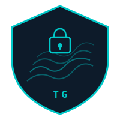

<p align="center">
  
</p>

<h1 align="center">TerraGuard</h1>
<p align="center">
  <strong>AI-powered security analysis for Terraform / HCL code</strong><br/>
  Detect misconfigurations, overpermissioned IAM, exposed resources, and hardcoded secrets — via a simple REST API.
</p>

<p align="center">
  
  
  
</p>

---

## What it does

TerraGuard analyzes Terraform HCL code or diffs and returns structured JSON with:

- **Security issues** — IAM wildcards, open Security Groups, unencrypted storage, public buckets, missing logging
- **Hardcoded secrets** — API keys, passwords, tokens, connection strings
- **Risk level** — CRITICAL / HIGH / MEDIUM / LOW per finding
- **Remediation advice** — specific fix for each issue

Built for integration into CI/CD pipelines, pre-commit hooks, or developer tooling.

---

## Endpoints

| Method | Endpoint | Description |
|--------|----------|-------------|
| GET | `/health` | Health check |
| POST | `/analyze` | Security analysis of HCL code |
| POST | `/secrets` | Hardcoded secrets detection |

### Request body (both POST endpoints)

```json
{ "hcl": "<terraform code or diff content>" }
```

**Limits:** max 8,000 chars of HCL (auto-truncated), 100KB body, 10 req/s per IP.

---

## Example — `POST /analyze`

```bash
curl -X POST https://terraguardapi.p.rapidapi.com/analyze \
  -H "Content-Type: application/json" \
  -H "X-RapidAPI-Key: YOUR_KEY" \
  -H "X-RapidAPI-Host: terraguardapi.p.rapidapi.com" \
  -d '{
    "hcl": "resource \"aws_security_group\" \"web\" {\n  ingress {\n    from_port   = 22\n    to_port     = 22\n    protocol    = \"tcp\"\n    cidr_blocks = [\"0.0.0.0/0\"]\n  }\n}"
  }'
```

**Response:**

```json
{
  "summary": "Security group allows unrestricted SSH access from the internet.",
  "risk_level": "CRITICAL",
  "issues": [
    {
      "severity": "CRITICAL",
      "category": "NETWORK",
      "title": "SSH open to the internet",
      "description": "Ingress rule allows port 22 from 0.0.0.0/0, exposing the instance to brute-force attacks.",
      "resource": "aws_security_group.web",
      "recommendation": "Restrict cidr_blocks to known IPs or use a bastion host / VPN."
    }
  ],
  "passed_checks": [],
  "total_issues": 1
}
```

## Example — `POST /secrets`

```bash
curl -X POST https://terraguardapi.p.rapidapi.com/secrets \
  -H "Content-Type: application/json" \
  -H "X-RapidAPI-Key: YOUR_KEY" \
  -H "X-RapidAPI-Host: terraguardapi.p.rapidapi.com" \
  -d '{
    "hcl": "resource \"aws_db_instance\" \"db\" {\n  password = \"mysecretpassword123\"\n}"
  }'
```

**Response:**

```json
{
  "secrets_found": true,
  "risk_level": "CRITICAL",
  "findings": [
    {
      "severity": "CRITICAL",
      "type": "PASSWORD",
      "description": "Hardcoded database password in plaintext",
      "location": "aws_db_instance.db.password",
      "recommendation": "Use a Terraform variable with sensitive=true, or retrieve from AWS Secrets Manager / SSM Parameter Store."
    }
  ],
  "total_findings": 1,
  "remediation_summary": "Move all secrets to environment variables or a secrets manager."
}
```

---


## License

MIT
